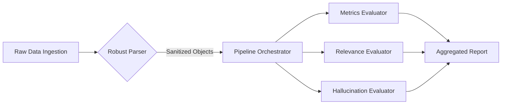

# Enterprise LLM Evaluation Pipeline

## 🚀 Overview

This repository houses a production-grade, modular evaluation pipeline designed to assess the quality, reliability, and cost-efficiency of Large Language Model (LLM) interactions in real-time. 

In the era of Generative AI, **trust is the new currency**. This pipeline implements a rigorous "LLM-as-a-Judge" framework to automatically quantify subjective metrics like *Relevance*, *Completeness*, and *Faithfulness (Hallucination)*, alongside deterministic operational metrics like *Latency* and *Token Cost*.

It is engineered to handle "dirty" real-world data, robustly parsing complex JSON structures with inconsistent schemas, ensuring that the evaluation layer is resilient to upstream data ingestion issues.

## 🛠️ Architecture

The system is built on a **Pipes and Filters** architectural pattern using Python, prioritizing **Decoupling** and **Extensibility**.



### Core Components used:
- **Strict Typing with Pydantic**: I use `Pydantic` models (`Conversation`, `Context`, `Message`) to enforce schema validation at the entry / ingress point. This "Fail Fast" approach prevents malformed data from polluting the evaluation logic.
- **Abstract Base Classes (ABC)**: All evaluators inherit from a `BaseEvaluator` interface. This allows new metrics (e.g., *Sentiment Analysis*, *Toxicity*, *Bias Detection*) to be hot-swapped or added without modifying the core orchestration logic—a critical feature for evolving AI safety standards.
- **Resilient Data Loading**: Custom Regex-based pre-processing handles common data quality issues found in production logs (C-style comments, trailing commas, control characters) without crashing the pipeline.

## 🧠 Evaluation Methodology

I employ a multi-dimensional evaluation strategy often referred to as **RAG Triad Evaluation**:

1.  **Contextual Faithfulness (Hallucination Detection)**:
    *   *Problem*: LLMs often "hallucinate" facts not present in the source documents.
    *   *Solution*: I utilize an LLM Judge (e.g., GPT-3.5/4) prompt-engineered to act as a strict fact-checker, comparing the *Assistant's Claim* against the *Retrieved Context Vectors*. This verifies that the answer is derived *only* from the provided source of truth.

2.  **Semantic Relevance & Completeness**:
    *   *Problem*: An answer can be factually true but irrelevant to the user's specific intent.
    *   *Solution*: A separate evaluator analyzes the *User Query* vs. *Assistant Response* semantic relationship, scoring the response on how directly and completely it addresses the prompt.

3.  **Operational Health (Latency & Cost)**:
    *   *Problem*: High accuracy is useless if it costs $10 per query or takes 20 seconds.
    *   *Solution*: I calculate precise latency from timestamp deltas and estimate costs using `tiktoken` to model the exact pricing of input/output tokens for specific model tiers (GPT-4 vs GPT-4o-mini).

## ⚡ Scaling to Millions of Conversations

While this repository demonstrates the core logic as a CLI, deploying this for **Million-Scale Daily Conversational Analytics** requires shifting to an Event-Driven Architecture:

### 1. Asynchronous Decoupling (The "Fire and Forget" Pattern)
Real-time evaluation cannot block the user request.
*   **Production Design**: The Chat Service pushes a completed conversation event to a `Kafka` topic or `SQS` queue.
*   **Worker Pool**: A cluster of Python workers (managed via `Celery` or `Kubernetes` Jobs) consumes these events. This allows the evaluator to scale independently of the chatbot traffic.

### 2. Cost Optimization Strategies
Running `GPT-4` based evaluation on 100% of traffic is cost-prohibitive.
*   **Sampling Strategy**: Perform deep LLM-based evaluation on a statistically significant sample (e.g., 5% of traffic) or on "Flagged" conversations (e.g., where user feedback was negative).
*   **Model Distillation**: Use smaller, fine-tuned models (e.g., `Llama-3-8B` or `GPT-4o-mini`) as the "Judge" for routine checks, reserving `GPT-4` only for complex arbitration.

### 3. Caching & Vector Stores
*   **Embedding Cache**: If I move to embedding-based similarity (Cosine Similarity) for relevance checks, I must cache document embeddings in `Redis` or `Pinecone` to avoid re-computing vectors for common queries.

## 💻 Local Setup & Usage

1.  **Environment**:
    ```bash
    pip install -r requirements.txt
    # Create .env file with OPENAI_API_KEY=sk-...
    ```

2.  **Run the Pipeline**:
    ```bash
    python main.py --conversation_path data/sample_conv.json --context_path data/sample_ctx.json
    ```

---
*Built with precision, designed for scale.*
